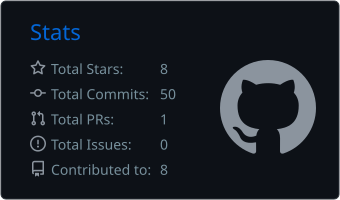
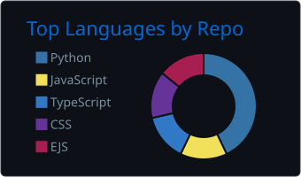
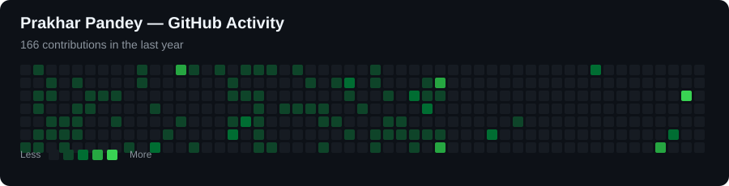

<!-- ===================================================== -->
<!--                  PRAKHAR PANDEY                       -->
<!-- ===================================================== -->

  

<!-- ==================== TYPING ==================== -->

  

  

---

<!-- ==================== ABOUT ME ==================== -->

## 👨‍💻 About Me

  <b>Computer Science & Engineering Student | Full-Stack Developer | AI/ML Enthusiast</b>

I'm a Computer Science & Engineering student passionate about building
**full-stack applications, AI-powered systems, and practical software solutions.**

- 💻 Building web applications using **React, Next.js, Node.js, Express & FastAPI**
- 🤖 Exploring **AI/ML and Computer Vision** using Python, YOLOv8, OpenCV & PyTorch
- 🚦 Developing an **AI-powered Smart Traffic Management System**
- 🧠 Strengthening my skills in **Data Structures, Algorithms & System Design**
- 🚀 Interested in building **scalable solutions for real-world problems**
- 📚 Continuously learning through projects, problem solving and hands-on development

---

<!-- ==================== TECH STACK ==================== -->

## 🛠️ Tech Stack

### 👨‍💻 Languages

  

### 🌐 Frontend

  

### ⚙️ Backend

  

### 🤖 AI / Machine Learning

  

### 🗄️ Databases

  

### 🔧 Tools & Platforms

  

---

<!-- ==================== GITHUB ANALYTICS ==================== -->

## 📊 GitHub Analytics

  

  

---

<!-- ==================== DEVELOPER STATS ==================== -->

## 📈 Developer Stats

---

<!-- ==================== GITHUB ACTIVITY ==================== -->

## 📈 GitHub Activity

  

---

<!-- ==================== ACHIEVEMENTS ==================== -->

## 🏆 Achievements

<table align="center">
  <tr>
    <td align="center">
      🏆 
      <b>Winner — Hackdiwas Hackathon</b>
    </td>
    <td align="center">
      🏆 
      <b>Winner — Udaan Sports Fest</b>
    </td>
    <td align="center">
      🥇 
      <b>Kho-Kho — Zonal Level 2024</b>
    </td>
  </tr>

  <tr>
    <td align="center">
      🚀 
      <b>Organizer — uHack 4.0</b>
    </td>
    <td align="center">
      👥 
      <b>Organizer — NSS 2026</b>
    </td>
    <td align="center">
      💼 
      <b>Technical Head — E-Cell, UIT</b>
    </td>
  </tr>
</table>

---

<!-- ==================== GITHUB TROPHIES ==================== -->

## 🏆 GitHub Trophies

  

---

<!-- ==================== CODING PROFILES ==================== -->

## 📌 Coding Profiles

&nbsp;&nbsp;&nbsp;&nbsp;

---

<!-- ==================== DSA PROGRESS ==================== -->

## 🧠 DSA & Problem Solving

<table align="center">
<tr>
<td width="33%" align="center">

### 🟢 Easy

`Arrays`  
`Strings`  
`Loops`  
`Sorting`  
`Searching`

</td>

<td width="33%" align="center">

### 🟡 Medium

`Recursion`  
`Linked List`  
`Stacks & Queues`  
`Trees`  
`Graphs`

</td>

<td width="33%" align="center">

### 🔴 Hard

`Dynamic Programming`  
`Graph Algorithms`  
`Greedy`  
`Backtracking`  
`Optimization`

</td>
</tr>
</table>

---

<!-- ==================== EXPERIENCE ==================== -->

## 💼 Experience & Leadership

### 💻 Software Development Engineer Intern — Bluestock.in

**Nov 2025 – Dec 2025**

- Worked on software development tasks and real-world application development.
- Collaborated with team members on development and implementation.
- Gained practical experience with software engineering workflows.

### 👥 Technical Head — E-Cell, UIT

**Sept 2025 – Aug 2026**

- Led technical initiatives and supported technology-driven events.
- Worked with team members to plan and execute technical activities.
- Contributed to innovation, development and technical coordination.

### 🤝 NSS Volunteer

**2024 – Present**

- Participated in community-oriented initiatives and institutional activities.
- Contributed to event organization and team coordination.

---

<!-- ==================== CURRENT PROJECT ==================== -->

## 🚀 Currently Working On

### 🚦 Smart Adaptive Traffic Management System

An AI-powered traffic management platform focused on:

- 🚗 Real-time vehicle detection
- 📊 Traffic density analysis
- 🚦 Adaptive traffic signal optimization
- 🚨 Real-time alerts
- 📹 AI-powered video analysis

**Tech Stack**

`Python` · `YOLOv8` · `OpenCV` · `FastAPI` · `Node.js` · `React` · `PostgreSQL`

  

---

<!-- ==================== FEATURED PROJECTS ==================== -->

## 🚀 Featured Projects

<table align="center">

  <tr>

    <td width="50%" valign="top">

### 🚦 Smart Traffic Management

AI-powered traffic management system using Computer Vision.

**Tech Stack**

`Python` `YOLOv8` `OpenCV` `FastAPI`  
`Node.js` `React` `PostgreSQL`

    </td>

    <td width="50%" valign="top">

### 🌦️ Weather WebApp

Responsive weather application providing real-time weather information.

**Tech Stack**

`HTML` `CSS` `JavaScript` `API`

    </td>

  </tr>

  <tr>

    <td width="50%" valign="top">

### 🤖 AI / Computer Vision

Exploring intelligent systems using object detection and image processing.

**Tech Stack**

`Python` `YOLOv8` `OpenCV` `PyTorch`

    </td>

    <td width="50%" valign="top">

### 💻 DSA-CPP

Consistent practice of Data Structures & Algorithms.

**Platforms**

`LeetCode` `GeeksforGeeks` `C++`

    </td>

  </tr>

</table>

---

<!-- ==================== CURRENT FOCUS ==================== -->

## 🎯 Current Focus

---

<!-- ==================== SKILLS ==================== -->

## 🛠️ What I Work With

<table align="center">
<tr>

<td align="center" width="33%">

### 💻 Development

`C++`  
`Python`  
`JavaScript`  
`React`  
`Next.js`  
`HTML / CSS`

</td>

<td align="center" width="33%">

### 🤖 AI / ML

`YOLOv8`  
`OpenCV`  
`PyTorch`  
`Machine Learning`  
`Computer Vision`

</td>

<td align="center" width="33%">

### ⚙️ Backend & Data

`Node.js`  
`Express.js`  
`FastAPI`  
`PostgreSQL`  
`MongoDB`  
`REST APIs`

</td>

</tr>
</table>

---

<!-- ==================== GOALS ==================== -->

## 🎯 Goals & Future Plans

<table align="center">
<tr>

<td align="center" width="25%">

### 💻
**DSA**

Strengthen problem solving and competitive programming

</td>

<td align="center" width="25%">

### 🚀
**Full-Stack**

Build scalable and production-ready applications

</td>

<td align="center" width="25%">

### 🤖
**AI / ML**

Build intelligent real-world systems

</td>

<td align="center" width="25%">

### 🎓
**GATE 2027**

Prepare consistently and achieve a strong score

</td>

</tr>
</table>

**Code → Build → Learn → Improve → Repeat 🚀**

---

<!-- ==================== CONTACT ==================== -->

## 📫 Open to & Contact

  <b>
    Open to Software Development, Full-Stack, AI/ML and Technical opportunities
  </b>

  📍 <b>Prayagraj, Uttar Pradesh, India</b>
  &nbsp;&nbsp; • &nbsp;&nbsp;
  🚀 <b>Open to Relocation</b>

---

<!-- ==================== DEVELOPER MINDSET ==================== -->

## ⚡ Developer Mindset

  <i>"Build. Learn. Improve. Repeat."</i>

  I don't just write code — I build intelligent systems that solve real-world problems.

---

<!-- ==================== FOOTER ==================== -->

  

  <b>⭐ If you find my projects useful, consider giving them a star!</b>

